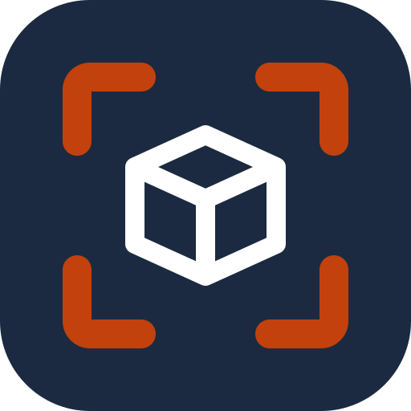

<p align="center">
  
</p>

<h1 align="center">NowStocking</h1>

<p align="center"><strong>Parts inventory · find it, scan it, pull it</strong></p>

<p align="center">
  A phone app for keeping track of every part in a kit build: where it's stored, whether it arrived, and how many are left.<br>
  It runs entirely on your own Cloudflare account.
</p>

<p align="center">
  <a href="https://github.com/particlep/nowstocking/actions/workflows/ci.yml"></a>
  <a href="LICENSE"></a>
  
</p>

<p align="center">
  <a href="https://nowstocking.com">nowstocking.com</a> ·
  <a href="#self-hosting">Self-hosting</a> ·
  <a href="docs/SPEC.md">Spec</a> ·
  <a href="LICENSE">MIT license</a>
</p>

---

NowStocking started in the shop of a Van's RV-14A build, where each kit arrives as a crate of bags, a multi-page packing
list and a binder of plans. Nothing in it is specific to one airplane. It works for any Van's model and for any kit that
ships with a packing list and step-by-step plans. That includes other kit aircraft and also kit cars, boats, CNC
machines and furniture.

- **Import packing lists from photos.** Pages are read in the background by Claude. Lines that were hard to read are flagged for a quick review against the photo.
- **Find any part fast.** Type `470ad45` and get `AN470AD4-5` with its bin, in big type. A part that shipped in two kits shows both locations.
- **Label and scan.** Print QR labels on Avery 5160 (bins) or 5163 (shelves) sheets. Scanning a label opens that bin's contents.
- **Put away in bulk.** Scan a bin once, then tap bags and parts as they go in. A bag's location covers every part inside it.
- **Pick lists from the plans.** Photograph an instruction page and get every part it calls for, matched to where it's stored.
- **Receiving, consumed and left, moves and splits, CSV export, emailed label PDFs.**
- **Works offline.** Everything lives on the phone. Edits queue up and sync when you're back online.

## How it's built

```
 iPhone (installed PWA)                          Cloudflare (your account)
 ┌────────────────────────────┐   HTTPS    ┌───────────────────────────────────────────┐
 │ Preact + preact-iso        │ ─────────▶ │ Access (email one-time PIN)               │
 │ IndexedDB: full copy       │            │   ▼                                       │
 │ Outbox of queued edits     │ ◀───────── │ Worker (Hono) + static assets             │
 │ Search, QR scan, PDFs      │   sync     │   ├─ Durable Object per warehouse:        │
 └────────────────────────────┘            │   │    inventory, sync, change log        │
                                           │   ├─ D1: users, accounts, warehouses      │
                                           │   ├─ R2: packing list / plans photos      │
                                           │   ├─ Workflows: read photos with Claude   │
                                           │   └─ Email Sending: label PDFs            │
                                           └───────────────────────────────────────────┘
```

| Layer | Choice |
|---|---|
| Frontend | Preact, preact-iso, Vite, vite-plugin-pwa, TypeScript |
| API | Cloudflare Worker with Hono, served from the same origin as the app |
| Data | A Durable Object (SQLite) per warehouse. D1 for the directory of users and accounts. R2 for photos |
| Background jobs | Cloudflare Workflows. Each photo is its own retried step |
| Photo reading | Claude API (`claude-opus-5`) with structured output |
| Auth | Cloudflare Access. The Worker verifies the Access JWT on every API call |
| Email | Cloudflare Email Sending (`send_email` binding) |
| Labels | jsPDF and qrcode, generated on the phone |
| Scanning | qr-scanner (Safari has no BarcodeDetector) |

### Sync in one paragraph

The phone keeps a full copy of the inventory in IndexedDB and reads only from it, so search and lookup work with no
signal. Every edit is a *mutation*: a list of field-level insert, update or delete ops with a client-generated UUID. It's
applied locally right away and queued in an outbox. The warehouse's Durable Object applies each mutation at most once,
as one SQLite transaction. It stamps every row with a version number from the warehouse's counter and writes a
field-level change log. Phones pull
`version > last seen`, including soft-delete tombstones. Row ids are random 52-bit integers made on the phone, so rows
created offline never need renumbering. Two people editing different fields of the same part both keep their changes.

### Accounts and warehouses

- **User:** a person who signs in.
- **Account:** a team, with owner, admin and member roles. A user can belong to more than one.
- **Warehouse:** a build or storage space inside an account, such as "RV-14A" or "Garage shelves". Each has its own
  parts, locations, pick lists and labels.

Each warehouse's data lives in its own Durable Object, so one warehouse can never read another's rows. The Worker checks
the D1 directory on every request to decide who may open which warehouse. Label QR codes include the warehouse
(`/w/<id>/loc/B03`), so labels from two builds never collide.

A self-hosted install runs with `SIGNUP_MODE = "single"`. Everyone who gets past Access joins one account, and the first
person to sign in is its owner. The hosted service uses `"open"`, where each new user gets their own account.

## Project layout

```
src/            Phone app: pages, components, IndexedDB store, sync, search
worker/         API: auth, directory (D1), routing, photo import, Workflow, email
worker/warehouse/  The Warehouse Durable Object: schema, mutations, sync, history, imports
shared/         Types and inventory rules used by both (effective location, CSV)
migrations/     D1 directory schema (warehouse schema is in worker/warehouse/schema.ts)
site/           The public nowstocking.com landing page (static, separate Worker)
docs/SPEC.md    The product spec and decisions
```

## Self-hosting

You need a Cloudflare account with a domain on it. The Workers Paid plan ($5/month) is recommended. Photo reading and
Workflows are heavier than the free plan's limits comfortably allow. Photo import also needs an
[Anthropic API key](https://console.anthropic.com/).

### 1. Clone and install

```sh
git clone https://github.com/particlep/nowstocking.git
cd nowstocking
npm install
npx wrangler login
```

### 2. Create the database and bucket

```sh
npx wrangler d1 create inventory
npx wrangler r2 bucket create imports
```

Put the new `database_id` into `wrangler.jsonc`, then apply the schema:

```sh
npm run db:migrate:remote
```

The database only holds the directory: users, accounts and warehouses. Each warehouse's inventory lives in a Durable
Object that is created automatically the first time the warehouse is opened.

### 3. Point it at your domain

In `wrangler.jsonc`, change the `routes` pattern to the hostname you want, for example `parts.example.com`. The
`workers.dev` URL and preview URLs stay off on purpose, so the only way in is through Access.

### 4. Put Cloudflare Access in front of it

In the Cloudflare dashboard, go to **Zero Trust → Access → Applications → Add an application → Self-hosted**:

1. Set the application domain to your hostname.
2. Add a policy that allows your email address (one-time PIN login is fine).
3. Set the session duration to **1 month**, so the app keeps working offline between logins.
4. Copy the application's **AUD tag**.

In `wrangler.jsonc`, set `ACCESS_TEAM_DOMAIN` to `https://<your-team>.cloudflareaccess.com` and `ACCESS_AUD` to that tag.
The Worker refuses every API request if these are missing.

### 5. Email (optional, for emailing label PDFs)

```sh
npx wrangler email sending enable example.com
```

Set `EMAIL_FROM` in `wrangler.jsonc` to an address on that domain.

### 6. Deploy

```sh
npm run deploy
npx wrangler secret put ANTHROPIC_API_KEY
```

Open your hostname in Safari on the phone, sign in, then **Share → Add to Home Screen**.

### 7. Deploy on push (optional)

`.github/workflows/ci.yml` runs the type check and tests on every push and pull request. On `main`, it then applies D1
migrations and deploys. To make it deploy your fork:

1. Change `github.repository == 'particlep/nowstocking'` in the deploy job to your repo.
2. Add two repository secrets:
   - `CLOUDFLARE_ACCOUNT_ID`
   - `CLOUDFLARE_API_TOKEN`: create it from the *Edit Cloudflare Workers* template, then add **D1: Edit**.
3. Remove the "Deploy landing page" step. It publishes `site/` to nowstocking.com.

### Costs

Hosting fits in the Workers Paid plan's included usage at hobby scale: a few thousand rows and a few hundred photos.
Claude usage is billed by Anthropic per photo read. The import model is the `IMPORT_MODEL` setting in `wrangler.jsonc`.

## Local development

```sh
cp .dev.vars.example .dev.vars   # skips Access locally and signs you in as dev@localhost
npm run db:migrate:local
npm run dev
```

Photo import needs `ANTHROPIC_API_KEY` in `.dev.vars`. Workflows, D1 and R2 all run locally.

| Command | What it does |
|---|---|
| `npm run dev` | App and Worker with hot reload |
| `npm test` | Tests, run in the Workers runtime against a local D1 |
| `npm run typecheck` | Type-check the app, Worker and tests |
| `npm run build` | Type-check and build |
| `npm run deploy` | Build and deploy the app |
| `npm run deploy:site` | Deploy the landing page in `site/` |
| `npm run db:migrate:local` / `:remote` | Apply D1 migrations |

## Tests

`npm test` runs [Vitest](https://vitest.dev) with the
[Cloudflare Vitest plugin](https://developers.cloudflare.com/workers/testing/vitest-integration/), inside `workerd`,
with the D1 migrations applied to a fresh local database:

- **`test/worker.test.ts`**: the API end to end.
  - Sign-in refuses unconfigured and tokenless requests.
  - Self-hosted and hosted sign-up work, and roles are enforced.
  - Accounts can't reach each other's warehouses or photos.
  - Warehouses keep separate inventories.
  - Mutations are idempotent, merge per field, and roll back completely when rejected.
  - Deletes sync as tombstones, large imports apply in one request, the change history records moves, and CSV export works.
- **`test/shared.test.ts`**: inventory rules. Effective location (bag inheritance, overrides, splits), remaining counts, and CSV.
- **`test/search.test.ts`**: search ranking, and matching plans part numbers to inventory.

CI runs the type check and tests on every push and pull request, and deploys only when they pass.

## Adapting it to another kit

Most of the app doesn't care what you're building. Locations, labels, search, put-away, receiving and pick lists work
for any parts with part numbers.

The two photo readers in `worker/import.ts` are where kit conventions show up:

- **The packing-list prompt** describes a sub-kit → bag → part list, with weights marked `(LB)`. That layout is common.
  If your supplier's lists look different, describe them in `SYSTEM`.
- **The plans-page prompt** lists example part-number formats (Van's `F-01412C`, AN/MS hardware). Add your
  manufacturer's formats to `INSTRUCTIONS_SYSTEM` so it knows what to look for.

Pull requests that make these prompts work for more kit makers are welcome.

## Contributing

Issues and pull requests are welcome. Please keep changes small and focused, and run `npm run build` before opening a
PR. Schema changes go in a new numbered file in `migrations/`.

## License

[MIT](LICENSE). NowStocking isn't affiliated with or endorsed by Van's Aircraft or any other kit manufacturer. Product
names are used only to describe where it came from and what it works with.
